# Threads Clone Android

As the name says this project is an clone of the popular application Threads. Made in android studio with JDK 17, Used Firebase for Database and Storage with basic plan.
Also i have tried my best to clone the UI of the threads application to make the project more like the real one.

## Screenshots

<div style="display:flex; gap:80; flex-wrap:wrap;">
    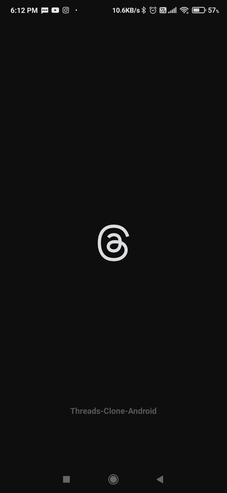
    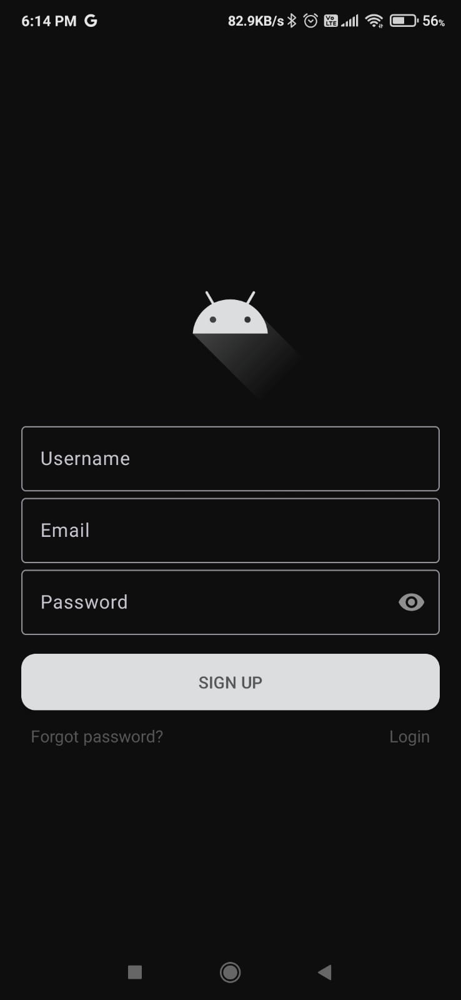
    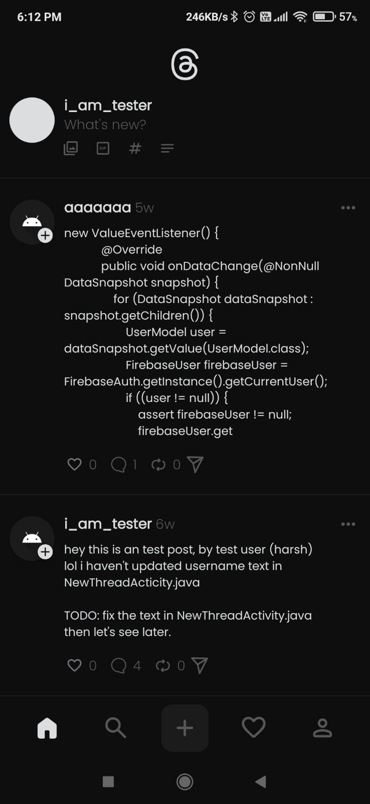
    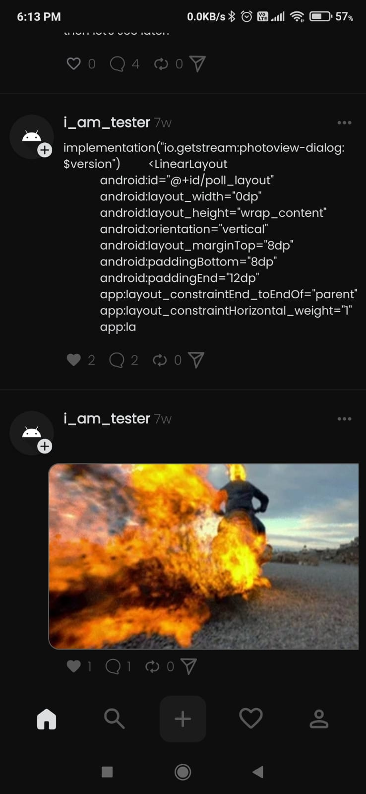
    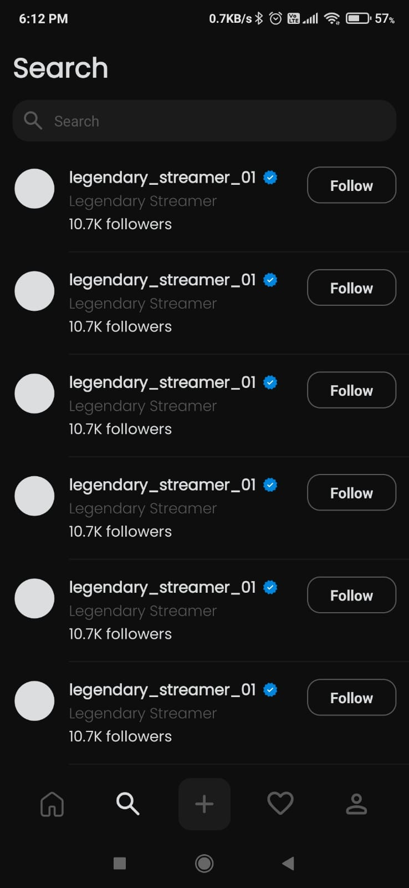
    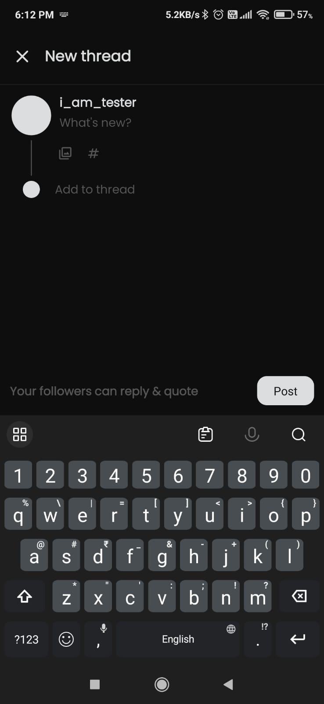
    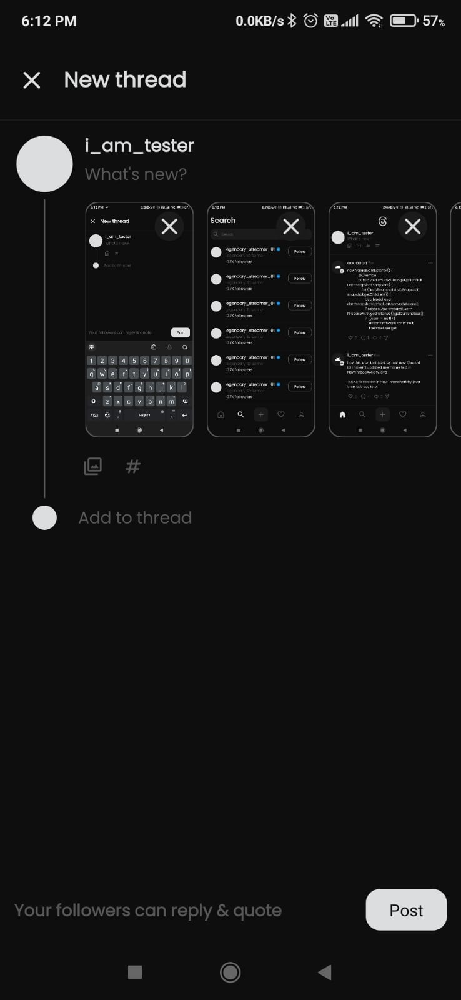
    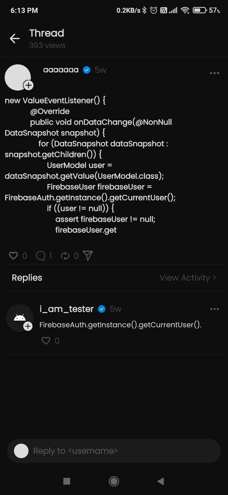
    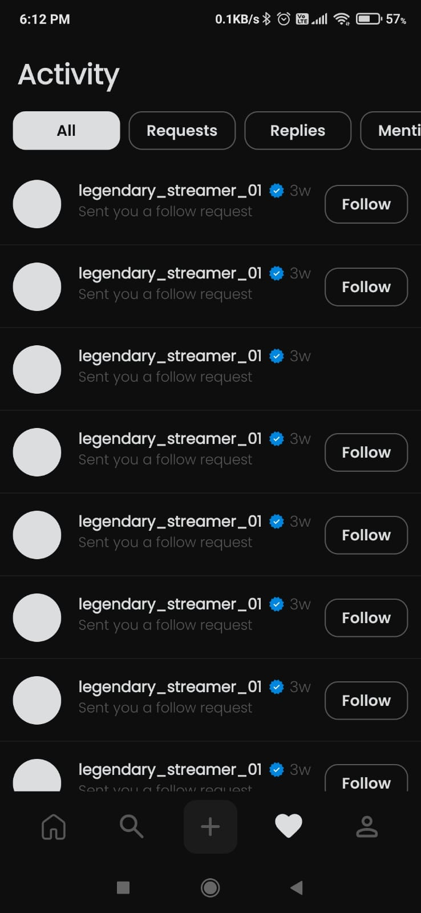
    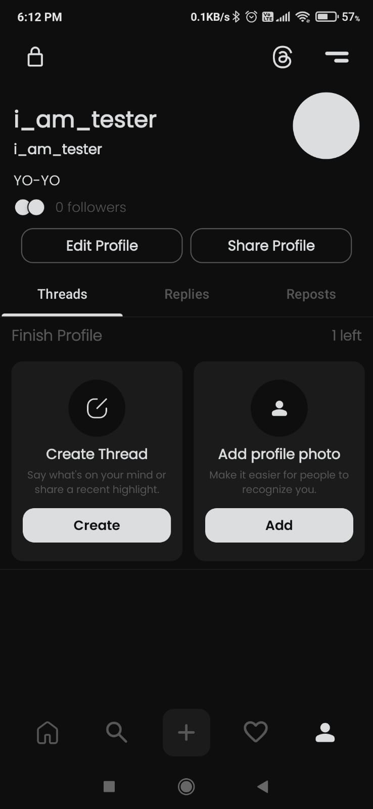
    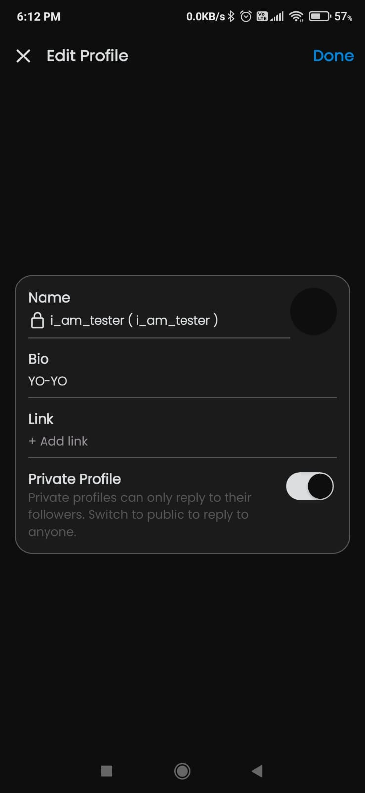
    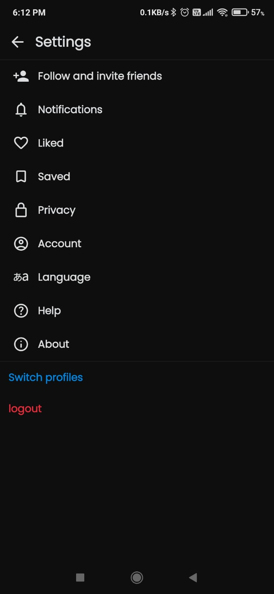
    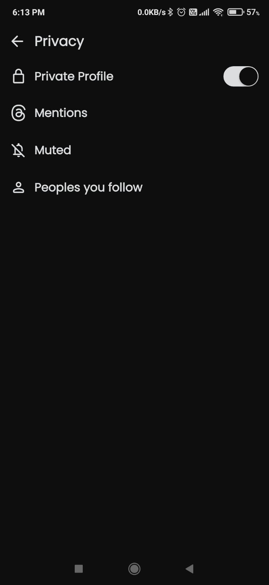
    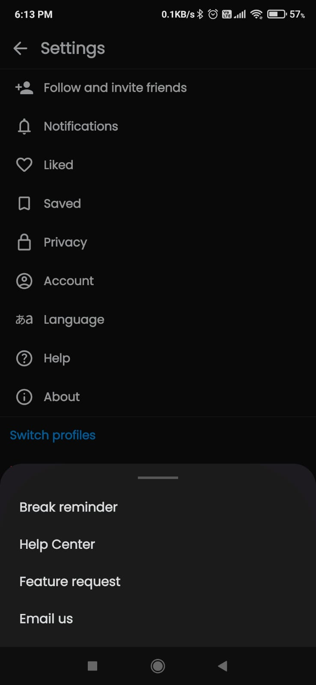
</div>

## Features

* Firebase capability
  * Database
  * Storage
  * Auth
* Posts Pagination
* Login / Signup
* Upload posts
  * With or Without GIF / IMAGE
* Posts
  * Create
  * Update
  * Delete
* Update Profile
* Clean settings UI
* Materialistic BottomSheetDrawer
* Custom Made Switch UI
* Comments
  * Create
  * Update
  * Delete
* Full screen IMAGE / GIF preview
* Likes on posts system

### Prerequisites

* Android Studio (latest version recommended)
* Java 8+
* An android device or emulator

### Installation

1. Clone the repository:

    ```bash
    git clone https://github.com/harshshah6/Threads-Clone-Android.git
    ```

2. Open the project in android studio
3. Build and run the app on your device or emualtor

## Built with

* [Java 8](https://openjdk.org/projects/jdk/8/) - The programming language used.
* [Glide](https://github.com/bumptech/glide) - Image library used to load the images from URL.
* [Picasso](https://github.com/square/picasso) - Image library used to load the images from URL.
* [Gson](https://github.com/google/gson) - Gson library to parse the json response from API.
* [OkHttp](https://github.com/square/okhttp) - Library to send requests to the APIs and receive the data.
* [SwiperefreshLayout](https://developer.android.com/jetpack/androidx/releases/swiperefreshlayout) - Library to add feature of pull to refresh list.
* [PhotoViewDialog](https://github.com/GetStream/photoview-android) - Dialog Modle Library to show full screen images/gif preview.
* [IVCompressor](https://github.com/techgnious/IVCompressor) - To compress the images while uploading in posts to save storage.

## Contributing

If you'd like to contribute to Threads Clone Android, here are some guidelines:

1. Fork the repository.
2. Create a new branch for your changes.
3. Make your changes.
4. Run the project to ensure it works.
5. Commit your changes.
6. Push your changes to your forked repository.
7. Submit a pull request.

## License

This project is licensed under the [MIT License](LICENSE).

## Acknowledgements

* [Harshshah6](https://github.com/harshshah6) - Creator of the project.
* [Firebase](https://firebase.google.com) - For Database, Auth, Storage.
